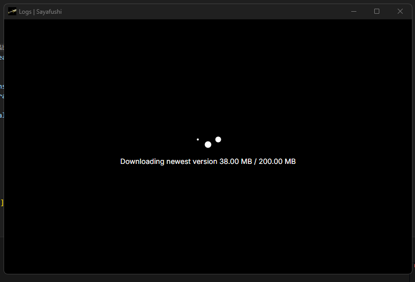

# 0.0.1

This is a preliminary list; I’ll continue adding items as they come to mind.

## Changes

The app has been split into the following folders:

- **app** – Tauri backend  
- **web** – Svelte/Vite frontend  
- **tools** – Anything related to CI/release, either consumed by GitHub Actions or run manually  

---

## App

- **Logic refactor:**  
  All core logic has been moved into appropriate modules, including:  
  - Creating system tray / handling events  
  - Window event handling  
  - Handling events from the web frontend  
  - Database calls  
  - Access to the shell  
  - Spawning background workers and packet-sniffing/processing  

- **Database migrator:**  
  - At startup, the app applies all scripts from the `migrations` folder  
  - Scripts must follow the format `[1-9*]_desc.sql`

- **Settings management:**  
  - On startup, the app will always create default settings from `settings.template.json` if no settings file is present  
  - All previously hardcoded API URLs have been moved into the settings file  

- **Tauri updater wrapper (DEV):**  
  - Provides a wrapper around the Tauri updater plugin  
  - Allows simulating downloads for testing for now

- **build.rs**
  - Applies Windows-specific manifest attributes only in production builds

- **Feature flags:**  
  - Introduced **develop** and **production** features  
  - **develop** → allows use of fake services regardless of debug/release mode  
  - **production** → applies Windows attributes to the binary  

- **Integration tests:**  
  - Currently, there is only one integration test for the database  
  - Ensures that on a fresh app install, the database is set up correctly  

---

## Web

- **Loading spinner:**  
  - When the app starts, the web frontend makes a `load()` call  
  - Tauri ensures that all assets are loaded and checks for active updates  
  - Tailored messages are shown based on the update state  

